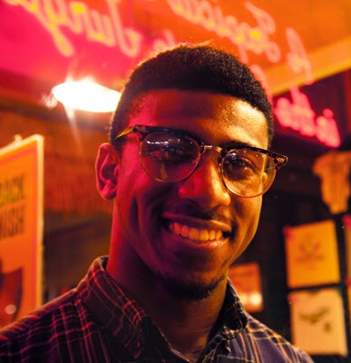

This is an [R Markdown](http://rmarkdown.rstudio.com) Notebook. When you execute code within the notebook, the results appear beneath the code. 

Try executing this chunk by clicking the *Run* button within the chunk or by placing your cursor inside it and pressing *Ctrl+Shift+Enter*. 

```{r}
plot(cars)
```

Add a new chunk by clicking the *Insert Chunk* button on the toolbar or by pressing *Ctrl+Alt+I*.

When you save the notebook, an HTML file containing the code and output will be saved alongside it (click the *Preview* button or press *Ctrl+Shift+K* to preview the HTML file).

The preview shows you a rendered HTML copy of the contents of the editor. Consequently, unlike *Knit*, *Preview* does not run any R code chunks. Instead, the output of the chunk when it was last run in the editor is displayed.

---

**NEED TO UPDATE TITLE TO MATCH SLIDES AND TAKE OUT HELP TEXT ABOVE**


# About This Notebook {-}

This notebook is for the Git Package submission for the INFM600 Team Project for the team of Vyjayanthi Kamath, Owen Henry, and Janice Chan, during the Fall 2018 semester.

Not included in this notebook: Presentation slides, which are available at **NEED LINK HERE**

# Data Cleaning Documentation

**Owen - INSERT UPDATED VERSION HERE FROM ORIGINAL GITHUB SUBMISSION**

# Data Analysis Script and Outputs

**VJ - INSERT FINAL CONSOLIDATED VERSION HERE INCLUDING PLOTS **

# Written Summary

**UP TO 500 WORDS - JANICE WILL INSERT AFTER WE EDIT FULLY IN GOOGLE DOC**

# Presentation Slides

Our presentation slides are available at **NEED LINK HERE**

# Contributorship

**JANICE WILL INSERT ONCE FINALIZED IN GOOGLE DOC**

# Appendix A - Persona {-}

## PERSONA: Adam Ward {-}

#

**Name:** Adam Ward

**Age:** 34

**Pronouns:** he/him/his

**Education:** Four-year degree

**Occupation:** Technical Project Manager

**Salary Range:** $85,000 - $100,000 USD/year

**Nationality:** American
 
>“Walking around to different banks and investors to present a slide deck in person?  That’s so old school.  The internet has opened up so many opportunities that weren’t there before.  It’s up to you to capitalize on them, but that doesn’t mean going in without a plan.”
 
**Bio:**

Adam is a project manager for a software development company.  He and his best friend from college, Michael, have an idea for an app that started because they were tired of going out with friends only to discover that it was a 45 minute wait to get into a restaurant that doesn’t take reservations, or that the bar they wanted to check out is packed full.  Their app would allow you to enter the name of the too-full restaurant and search nearby and suggest venues with similar food, ambiance, price points, etc.  They want to partner with new restaurants as well so that suggestions can cater to those who want to try something new.  However, both of them work very demanding jobs and they don’t have enough free time to work on their dream.
 
**User Goals:**

- Quit his job to focus on the app full-time

- Build the app and turn it into a startup
 
**User Needs:**

- Needs to be able to raise funds fairly quickly and, because he has a demanding job, without too much time and effort required.

- Needs to be able to pay rent in Washington, DC, his student loans, car payments, and other living expenses—like food!  So, if it doesn’t raise at least a certain amount, it may not be worth it if he doesn’t raise enough to quit his job.

- Wants to be able to create a data-driven campaign for the best chances of success.
 
**Pain Points:**

- He doesn’t want to have to talk to people to raise money.  It takes a lot of time and is very draining for him as an introvert.

- He is not a data analyst, so even though there is a lot of data out there, he finds it a bit overwhelming.

- He’s short on time.
 
**Beliefs:**

- Success is made, not given.  Entrepreneurship is the only way to ensure success.

- Everybody has this problem of crowded restaurants--they’ll definitely want my app!

- I will be in that 1%.
 
**Biases/Preferences:**

- Digital first - The first question is always, “Can I do it online?”

- Is okay with taking some risk, but prefers they be calculated
 
**Expertise:**

- As a project manager, he’s pretty comfortable with creating a plan and executing it with a team, managing budgets, and staying on track.  This seems to him that it would be like running a business, but he has not actually run a business before.

- He has occasionally supported Kickstarter campaigns, but has never created any type of crowdfunding or fundraising campaign before.
 
**Personality:**

- Introvert

- Likes to be helpful and share his knowledge

- Deliberate

- Planner

*Photo by Maria Badasian on Unsplash.com, used under a CC0 license*
 


